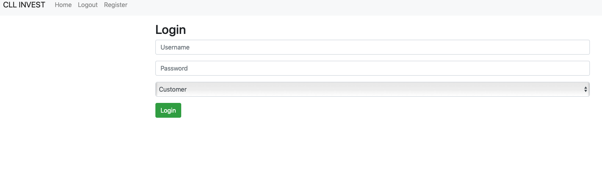
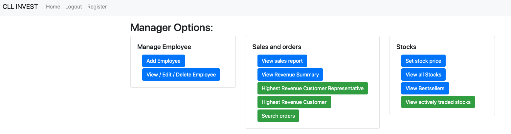
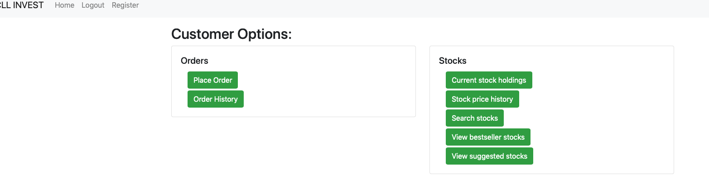
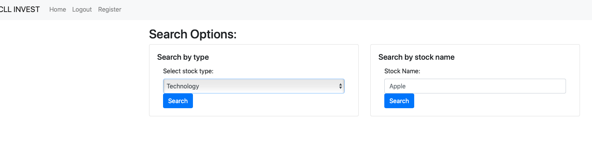

CLL Invest (Stock Trading System)
========
**Authors:** [slljack](https://github.com/slljack), [James C](James.cimino@stonybrook.edu), and [Andrew L](andrew.liu@stonybrook.edu)

***
In this project, we designed and built a webApp that allows customer to trade stocks. The database is desugned in MySQL. This database stores the information of Stocks, customers, employees, and managers. This database also has many built-in transactions and is running behind a webpage that includes all the user interface. For the server we used TomCat 9.0.

***
### Manager-Level Transactions
* Set the share price of a stock
* Add, Edit and Delete information for an employee
* Produce a comprehensive listing of all stocks
* Produce a list of orders by stock symbol or by customer name
* Produce a summary listing of revenue generated by a particular stock, stock type, or customer
* Obtain a sales report for a particular month
* Determin which customer representative generated most total revenue
* Determin which customer generated most total revenue
* Produce a list of most actively traded stocks

***
### Customer-Representatives-Level Transactions
* Record an order
* Add, Edit and Delete information for a customer
* Produce customer mailing lists
* Produce a list of stock suggestions for a given customer

***
### Customer-Level Transactions
* Get the customer's current stock holdings
* Get the share-price and trailing-stop history for a given conditional order
* Get the share-price and hidden-stop history for a given conditional order
* Get the share-price history of a given stock over a certain period of time
* Get the history of all current and past orders a customer has placed
* Get stocks available of a particular type and most-recent order info
* Get stocks available with a particular keyword or set of keywords in the stock name, and most-recent order info
* Produce Best_Seller list of stocks
* Personalized stock suggestion list

*** 
### LogIn Information
URL = jdbc:mysql://mysql4.cs.stonybrook.edu:3306/andliu?user=andliu
user = andliu
password = 111473795

